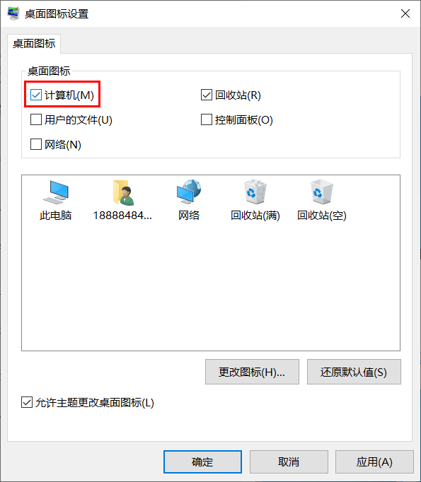
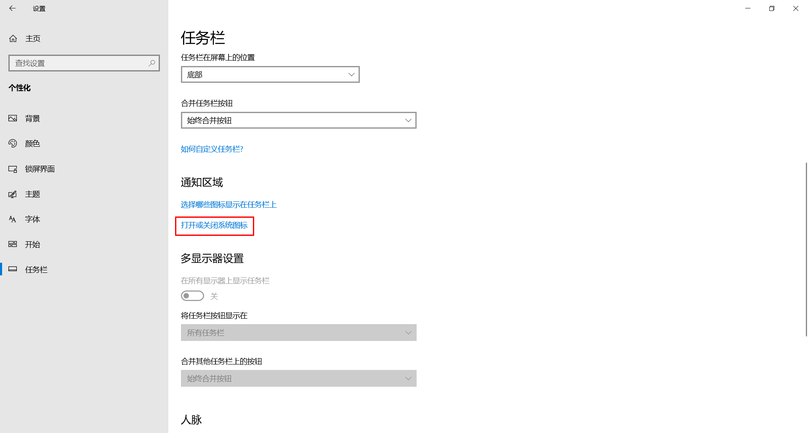
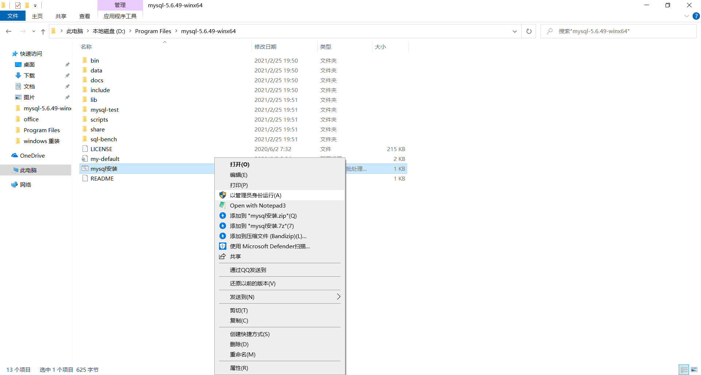

# 此电脑

桌面右键单击`个性化`->`主题`->`桌面图标设置`->勾选`计算机`




# 显示扩展名


# 任务栏

## 右侧垃圾清理


## 左侧垃圾清理

个性化->任务栏->打开或关闭系统图标





## 固定到任务栏

- XYplorer
- IntelliJ IDEA
- Notepad3
- Typora
- Visual Studio Code

# 磁贴

## 清理垃圾


## 固定到开始屏幕

- 
  RegexBuddy 4

- 
  FSCapture

- 
  腾讯QQ

- 
  Firefox

- 
  Internet Download Manager

- 
  Everything

- 
  ScreenToGif

- 
  Navicat Premium 12

- 
  Xshell 5

- 
  WinSCP

- 
  网易有道词典


# D盘目录

## 图标

### desktop.ini

- 在一个文件夹下新建`desktop.ini`文件并输入以下内容，指定 **IconResource** 为 `index.ico` 

  ```
  [ViewState]
  Mode=
  Vid=
  FolderType=Generic
  [.ShellClassInfo]
  IconResource=index.ico,0
  ```

- 再在此文件夹下放置一个名为 `index.ico` 的文件
- 最后将`desktop.ini` 、`index.ico` 设置为隐藏，该文件夹图标即变为 `index.ico`

### [制作DESKTOP.INI文件改文件夹图标无效](https://ask.zol.com.cn/x/4562536.html)

不是每个文件夹都可以设置desktop.ini的，windows设置只有系统文件夹才接受desktop的设置。

将文件夹转换为系统文件夹方法：按WIN键+R键，输入cmd，调出命令提示符，输入`attrib 你想要转换的文件夹路径 +s /d`。比如你想要设置的文件夹为**d**盘下的**pic**文件夹，即在命令提示符中输入`attrib d:\pic +s /d`即可。

```
attrib . +s /d
```

# 任务管理器

## 更改下载位置


## 更改桌面位置


## 删除多余文件夹

[win10设置](./reg/win10设置.reg)

# [Start Menu](C:\ProgramData\Microsoft\Windows\Start Menu\Programs)

下面的软件创建快捷方式放到 **Start Menu**

- [JiJiDownForWPF.lnk](..\Desktop\JiJiDownForWPF.lnk) 

-  [tomcat-shutdown.lnk](..\Desktop\tomcat-shutdown.lnk) 

   [tomcat-startup.lnk](..\Desktop\tomcat-startup.lnk) 

- [BitComet_x64.lnk](..\Desktop\BitComet_x64.lnk) 

-  [GitHub Desktop.lnk](..\Desktop\GitHub Desktop.lnk) 

# 计算机环境

## jdk-11.0.4

- `JAVA_HOME`

  ```
  C:\Program Files\Java\jdk-11.0.4
  ```
  
- `CLASSPATH`

- ```
  .;%JAVA_HOME%\lib;%JAVA_HOME%\lib\tools.jar
  ```

- `Path`

```
%JAVA_HOME%\bin
```

## apache-tomcat-8.5.46

### 环境变量

- `CATALINA_HOME`

  ```
  D:\Program Files\apache-tomcat-8.5.46
  ```

- `Path`

  ```
  %CATALINA_HOME%\bin
  ```

### tomcat 闪退

```
set JAVA_HOME=C:\Program Files\Java\jdk-11.0.4\
```


### 字符乱码

控制台输出设为 GBK


## mysql-5.6.49-winx64

### 安装 vcredist_x64



### 管理员身份运行

在 `mysql-5.6.49-winx64` 目录下以管理员身份运行如下脚本：

```
D:
cd %~dp0

rem 对系统变量 Path 追加 新变量 newpath1、newpath2
set currentPath=%Path%
setx "Path" "%currentPath%;%~dp0bin" /m

echo basedir = %~dp0>>my-default.ini
echo datadir = %~dp0data>>my-default.ini

cd bin
mysqld -install

rem 验证是否成功：在命令行输入：services.msc  ,打开服务查看器可以看到mysql
services.msc
```

### 配置账号密码

```
mysql -u root -p


use mysql;
update user set password=password("root") where user="root";
flush privileges;
```

[配置记录](log/mysql-5.6.49-winx64.txt)


## cnpm

使用阿里定制的cnpm命令行工具代替默认的npm，输入以下代码

```
npm install -g cnpm --registry=https://registry.npm.taobao.org
```

检测是否安装成功

```
cnpm -v
```

# 软件设置

## Typora


## XYplorer

载入 [XYplorer配置](./ conf/XYplorer.ini) 

## Firefox

### 书签


### 登录

- [Github](https://github.com/login?return_to=%2FXUAN-CW)
- [stackoverflow](https://stackoverflow.com/users/login?ssrc=head&returnurl=https%3a%2f%2fstackoverflow.com%2f)
- [52pojie](https://graph.qq.com/oauth2.0/show?which=Login&display=pc&response_type=code&client_id=310187341&redirect_uri=https%3A%2F%2Fwww.52pojie.cn%2Fconnect.php%3Fmod%3Dlogin%26op%3Dcallback%26referer%3Dindex.php&state=2e1f49b917ebbec014e8b4aab64d2987&scope=get_user_info%2Cadd_share%2Cadd_t%2Cadd_pic_t%2Cget_repost_list)
- [CSDN](https://passport.csdn.net/login?code=public)
- [bilibili](https://www.bilibili.com)

### 广告拦截

[AdGuard AdBlocker](conf/AdGuard AdBlocker-adg_ext_user_filter.txt)


## QQ

- 3371910558

- 3593141687
- 3308065232

## Bandizip


## GitHubDesktopSetup

登录

## Xshell


## potpalyer


## IDEA

导入设置 [settings.zip](./conf/settings.zip)

## WinSCP


